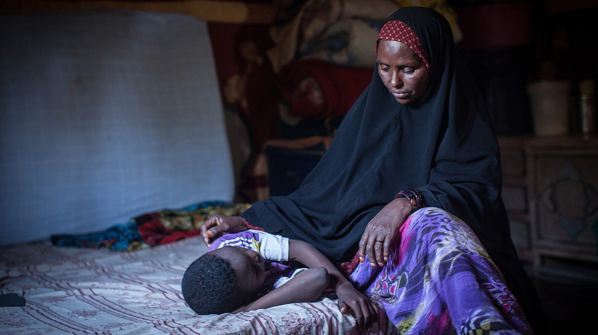

```{r setup, include = FALSE}
knitr::opts_chunk$set(echo = TRUE, cache = TRUE, warning = FALSE, message = FALSE)
```

## Background

Female genital mutilation is practiced in cultures that believe in removing sexual desire of women. They believe it is a man's right to marry a virgin. To enforce the chastity of women, the clitoris of young girls is removed, usually by an untrained individual and in unsanitary conditions, and her labia majora is typically sewn shut. This practice is sickening, but still happens to 3 million girls annually, even in the US and to girls as young as 3 years old. It is most prevalent in the Middle East, Africa, and Asia.

FGM is a violation of human rights. It causes extreme pain and irreversible damage. Some side effects include scarring, sexual dysfunction, childbirth issues, depression, and anxiety.



## Data

The data analyzed for this project was collected by the unicef which aims to improve and protect the rights of children worldwide. The data was last updated in March 2024 and includes women aged 15-49.

```{r load_libraries, echo=TRUE, message=FALSE}
# Load necessary libraries
library(tidyverse)
library(ggplot2)
library(caret)
library(readxl)
library(dplyr)
library(tidyr)
library(easystats)
```

## Cleaning the Data

### Before

```{r before cleaning, echo=TRUE, message=FALSE}
raw_data <- read_excel('media/XLS_FGM-Women-prevalence-database_Mar-2024.xlsx', 
                       sheet = "Women FGM", skip = 6) 
print(raw_data)
```

The data is super messy! Here's what I did to clean it up.

### After

```{r Cleaning the Data, echo = TRUE}

clean_data <- raw_data[-c(1:3), ]

# Renaming the columns
colnames(clean_data) <- c(
  "Country", "Prevalence_Total", "NA1",
  "Residence_Urban", "NA2", "Residence_Rural",
  "NA3", "Wealth_Poorest", "NA4",
  "Wealth_Second", "NA5", "Wealth_Middle", "NA6",
  "Wealth_Fourth", "NA7", "Wealth_Richest", "NA8", "Year", "Source"
)

# Dropping NA
clean_data <- clean_data %>%
  select(-starts_with("NA")) 


# Remove rows with all NAs
clean_data <- clean_data %>% filter(!if_all(everything(), is.na))
clean_data2 <- clean_data %>%
  mutate(across(where(is.character), ~na_if(.x, "-"))) %>%
  mutate(across(c(Prevalence_Total, Residence_Urban, Residence_Rural,
                  Wealth_Poorest, Wealth_Second, Wealth_Middle,
                  Wealth_Fourth, Wealth_Richest), as.numeric))
FGM <- clean_data2 %>% 
  filter(!if_all(c(Prevalence_Total, Residence_Urban, Residence_Rural,
                   Wealth_Poorest, Wealth_Second, Wealth_Middle,
                   Wealth_Fourth, Wealth_Richest), is.na)) 

FGM_long <- FGM %>%
  pivot_longer(cols = starts_with("Wealth_"), names_to = "Wealth_Group", values_to = "FGM_Prevalence")


FGM_long$Wealth_Group <- factor(FGM_long$Wealth_Group,
                                 levels = c("Wealth_Poorest", "Wealth_Second", "Wealth_Middle",
                                            "Wealth_Fourth", "Wealth_Richest"),
                                 labels = c("Poorest", "Second", "Middle", "Fourth", "Richest"))
print(FGM_long)

```

Much better! Now let's analyze it.

## Finding Relationships Between Wealth and Prevalence of FGM

```{r making models, echo=TRUE, message=FALSE}
mod1 <- glm(data = FGM,
            formula = Prevalence_Total ~ Residence_Rural)

mod2 <- glm(data = FGM,
            formula = Prevalence_Total ~ Residence_Rural * Wealth_Poorest)

mod3 <- glm(data = FGM,
            formula = Prevalence_Total ~ Residence_Urban)
performance(mod3)

model_multi <- lm(Prevalence_Total ~ Wealth_Second + Wealth_Middle + Wealth_Fourth + Wealth_Richest, data = FGM)
summary(model_multi)


mod4 <- glm(Prevalence_Total ~ Residence_Urban + Residence_Rural +
              Wealth_Poorest + Wealth_Second + Wealth_Middle,
            data = FGM)

compare_performance(mod1, mod2, mod3, mod4) %>% plot()
```
It looks like model 4 is the best at predicting correlation between factors. Let's see how wealth affects FGM prevalence.

```{r graph1, echo=TRUE, message=FALSE}

ggplot(FGM_long, aes(x = Wealth_Group, y = FGM_Prevalence)) +
  geom_boxplot(fill = "#FC9272", color = "#CB181D") +
  labs(title = "FGM Prevalence by Wealth Group",
       x = "Wealth Quintile",
       y = "FGM Prevalence (%)") +
  theme_minimal()

```

This graph shows that FGM is most prevalent in poor countries on average.

```{r graph2, echo=FALSE, message=FALSE}

FGM_avg <- FGM_long %>%
  group_by(Wealth_Group) %>%
  summarize(Avg_FGM = mean(FGM_Prevalence, na.rm = TRUE))

ggplot(FGM_avg, aes(x = Wealth_Group, y = Avg_FGM, group = 1)) +
  geom_line(color = "#2C7BB6", size = 1.2) +
  geom_point(size = 3, color = "#2C7BB6") +
  labs(title = "Average FGM Prevalence by Wealth Quintile",
       x = "Wealth Group", y = "Average FGM Prevalence (%)") +
  theme_minimal()
```

```{r top country, echo=TRUE, message=FALSE}
top_country <- FGM %>%
  filter(!is.na(Prevalence_Total)) %>%
  arrange(desc(Prevalence_Total)) %>%
  slice(1)

print(top_country)

```
```{r top countryg, echo=TRUE, message=FALSE}
top_country_urban_rural <- FGM %>%
  filter(Country == top_country$Country) %>%
  select(Residence_Urban, Residence_Rural) %>%
  pivot_longer(cols = everything(), names_to = "Residence", values_to = "FGM_Prevalence")

ggplot(top_country_urban_rural, aes(x = Residence, y = FGM_Prevalence)) +
  geom_col(fill = "#3690C0") +
  labs(title = paste("Urban vs Rural FGM in", top_country$Country),
       x = "Residence",
       y = "FGM Prevalence (%)") +
  theme_minimal()
```

## Discussion and Conclusion

The average FGM prevalence graph above shows that as wealth increases, the prevalence of FGM decreases. This means that women in poorer and underdeveloped countries are more likely to suffer from FGM. Additionally, Somalia--an East African country--has the highest prevalence of FGM with 99% of women 15-49 suffering from this brutal practice. While it is true that a country's wealth is a big predictor of whether FGM is prevalent or not, other factors could influence prevalence. For example, cultural norms and beliefs affect prevalence but it is difficult to collect data based on culture. Though this practice is still very common today, there is hope. Women in these countries have begun trying to shift gender norms and advocate for women's rights.